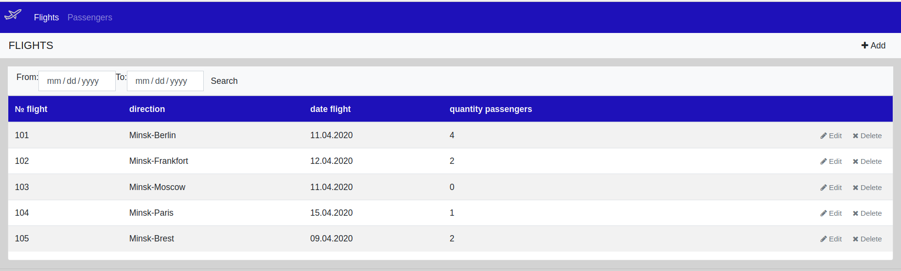
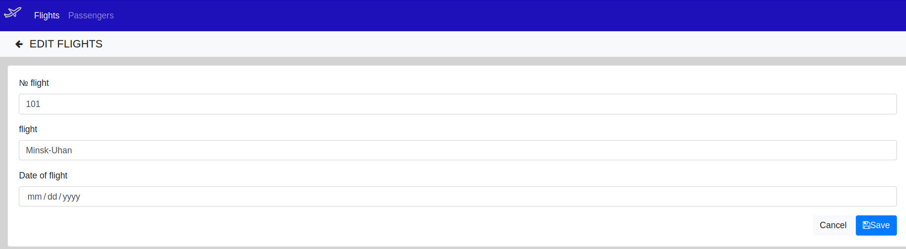
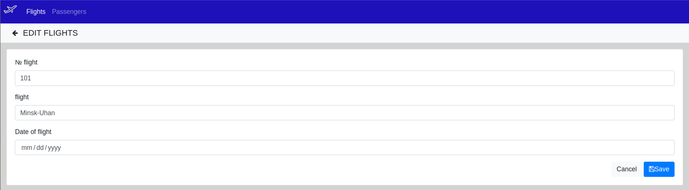
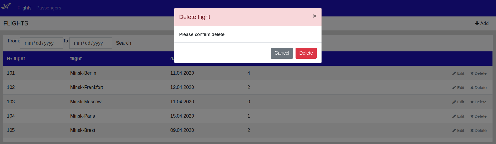
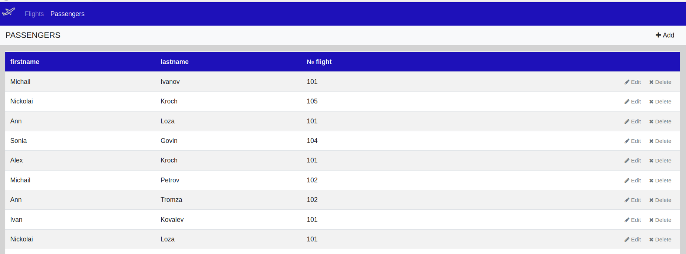
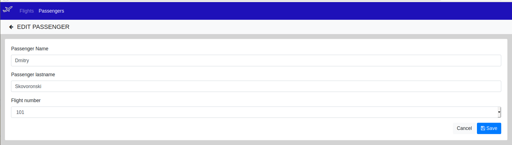
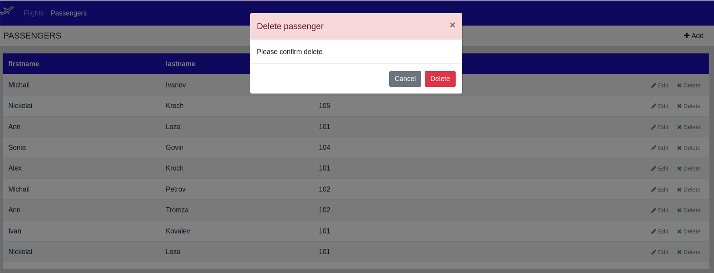

***Тема «Аэропорт».***

**Видение проекта**

Требуется Web-приложение для контроля количества забронированных билетов на рейсы в аэропорту 
и бронирования билетов на рейс.
Приложение должно реализовывать следующие функции:

- Просмотр списка рейсов.

- Редактирование этого списка.

- Отображения количества пассажиров забронировавших билеты на рейс.

- Выбор рейсов, используя фильтр по дате.

- Просмотр списка пассажиров забронировавших билеты на рейс.

- Редактирование списка пассажиров.

**1. Рейсы**

*1.1 Просмотр списка рейсов*
   
- Данный режим приложения позволяет просматривать список рейсов,  а так же количества забронированных билетов 
на каждый рейс (отображаются колонки «№ flight», «direction», «date flight», «quantity passengers»).

*1.2 Добавление рейса*

*Сценарий добавления нового рейса:*

- В режиме просмотра списка рейсов, пользователь нажимает клавишу «Add»

- Отображается режим добавления рейса.

- Пользователь вводит данные (номер рейса, направление полета и дата вылета) и нажимает «Save».

- Если данные введены корректно, то рейс добавляется в базу данных.

- Если данные введены не корректно, то отображается предупреждение о вводе некорректных данных.

- Если произошла ошибка сохранения данных, - выводится сообщение об ошибке сохранения данных.

- Если рейс успешно добавлен, то открывается режим просмотра списка рейсов.

*Сценарий отмены создания нового рейса:*

- В режиме просмотра списка рейсов, пользователь нажимает клавишу «Add»

- Отображается режим добавления рейса.

- Пользователь нажимает «Cancel».

- Данные не сохраняются в базу данных, и открывается режим просмотра списка рейсов.

*1.3 Редактирование рейса*

*Сценарий редактирования рейса:*

- В режиме просмотра списка рейсов, пользователь нажимает клавишу «Edit».

- Отображается режим редактирования текущего рейса.

- Пользователь изменяет данные (номер рейса, направление полета или дата вылета) и нажимает «Save».

- Если данные введены корректно, то рейс добавляется в базу данных.

- Если данные введены не корректно, то отображается предупреждение о вводе некорректных данных.

- Если произошла ошибка сохранения данных, - выводится сообщение об ошибке сохранения данных.

- Если рейс успешно добавлен, то открывается режим просмотра списка рейсов.

*Сценарий отмены редактирования текущего рейса:*

- режиме просмотра списка рейсов, пользователь нажимает клавишу «Edit».

- Отображается режим редактирования текущего рейса.

- Пользователь нажимает «Cancel».

- Данные не сохраняются в базу данных, и открывается режим просмотра списка рейсов.

*1.4 Удаление рейса*

*Сценарий удаления рейса:*

- В режиме просмотра списка рейсов, пользователь нажимает клавишу «Delete».

- Происходит проверка на наличие брони билетов на текущий рейс.

- Если на текущий рейс осуществлена бронь билетов, то пользователь получает предупреждение о наличии брони.

- Если на текущий рейс отсутствует бронь билетов, то выводится диалоговое окно для подтверждения удаления рейса.

- Пользователь нажимает «YES».

- Происходит удаление рейса из базы данных.

- Если произошла ошибка удаления данных, то выводится сообщение об ошибке.

- Если рейс успешно удален, то открывается режим просмотра списка рейсов.

*Сценарий отмены удаления текущего рейса:*

- В режиме просмотра списка рейсов, пользователь нажимает клавишу «Delete».

- Происходит проверка на наличие брони билетов на текущий рейс.

- Если на текущий рейс осуществлена бронь билетов, то пользователь получает предупреждение о наличии брони.
    
- Пользователь нажимает «Cancel».

- Открывается режим просмотра списка рейсов.

**2. Пассажиры**

*1.1 Просмотр списка пассажиров*

*Данный режим приложения позволяет просматривать список пассажиров:*

- Пользователь выбирает вкладку «Pessengers».

- Отображается форма просмотра списка пассажиров. (в списке отображаются колонки «firstname», «lastname», «№ flight»)

*2.2 Добавление пассажира*

*Сценарий добавления пассажира забронировавшего билет на рейс:*

- В режиме просмотра списка рейсов, пользователь нажимает клавишу «Add»

- Отображается режим добавления пассажира.

- Пользователь вводит данные (имя пассажира, фамилия пассажира, номер рейса) и нажимает «Save».

- Если данные введены корректно, то пассажир добавляется в базу данных.

- Если данные введены не корректно, то отображается предупреждение о вводе некорректных данных.

- Если произошла ошибка сохранения данных, - выводится сообщение об ошибке сохранения данных.
 
- Если пассажир успешно добавлен, то открывается режим просмотра пассажиров, забронировавших билет на рейс.

*Сценарий отмены добавления нового пассажира:*

- В режиме просмотра списка пассажиров, пользователь нажимает клавишу «Add»

- Отображается режим добавления пассажира.

- Пользователь нажимает «Cancel».

- Данные не сохраняются в базу данных, и открывается режим просмотра пассажиров.

*2.3 Редактирование данных пассажира*

*Сценарий редактирования данных пассажира:*

- В режиме просмотра списка пассажиров, пользователь нажимает клавишу «Edit».

- Отображается режим редактирования текущего рейса.

- Пользователь изменяет данные (имя пассажира, фамилия пассажира, номер рейса) и нажимает «Save».

- Если данные введены корректно, то пассажир добавляется в базу данных.

- Если данные введены не корректно, то отображается предупреждение о вводе некорректных данных.

- Если произошла ошибка сохранения данных, - выводится сообщение об ошибке сохранения данных.

- Если пассажир успешно добавлен, то открывается режим просмотра пассажиров, забронировавших билет на рейс.

*Сценарий отмены редактирования текущего рейса:*

- В режиме просмотра списка пассажиров, пользователь нажимает клавишу «Edit».

- Отображается режим добавления пассажира.
 
- Пользователь нажимает «Cancel».
 
- Данные не сохраняются в базу данных, и открывается режим просмотра пассажиров.

*2.4 Удаление данных пассажира*

*Сценарий удаления данных пассажира:*

- В режиме просмотра списка пассажиров, пользователь нажимает клавишу «Delete».

- Выводится диалоговое окно для подтверждения удаления данных пассажира.

- Пользователь нажимает «YES».

- Происходит удаление данных пассажира из базы данных.

- Если произошла ошибка удаления данных, то выводится сообщение об ошибке.

- Если данные о пассажире успешно удалены, то открывается режим просмотра списка пассажиров.

*Сценарий отмены удаления текущего рейса:*

- В режиме просмотра списка пассажиров, пользователь нажимает клавишу «Delete».

- Пользователь нажимает «Cancel».
 
- Открывается режим просмотра списка пассажиров.
